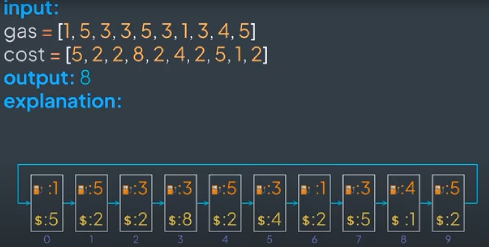

# Gas Station

Given a circular list of gas stations, where we can go from station `i` to station `i+1`, and the last one goes back to the first one, find the index of the station where we start to be able to traverse all the stations and go back to the initial one without running out of gas.

Note that:
- We can only move forward;
- The gas tank starts empty;
- `gasStation[i]` represents the amount of gas at the station `i`;
- `gasCost[i]` represents the cost to go from the station `i` to the next one;
- The answer is guaranteed to be unique;
- If it's impossible to traverse all the circuit no matter what gas station we start from, return `-1`;

 

